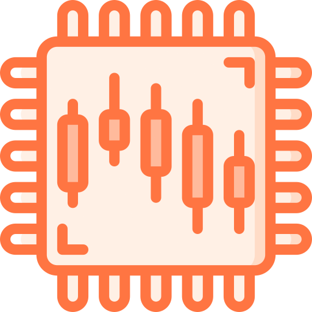

<p align="center">
 
</p>

<div id="toc" align="center">
  <ul style="list-style: none;">
    <summary>
      <h1 align="center">
        Process Manager
      </h1>
    </summary>
  </ul>
</div>

<h3 align="center">
  No hang survives
</h3>

<p align="center">
  <a href="https://github.com/CaymanFreeman/ProcessManager/blob/main/LICENSE-MIT.md"></a>&nbsp;
  <a href="https://github.com/CaymanFreeman/ProcessManager/blob/main/LICENSE-APACHE.md"></a>&nbsp;
  <a href="https://www.rust-lang.org/"></a>&nbsp;
  <a href="https://www.linkedin.com/in/caymanfreeman/"></a>
</p>

## Overview

Process Manager is a simple table view of the running system processes, much like Windows Task Manager or GNOME
System Monitor. Clicking on a process will display a control panel where you can stop the process or copy its
information.

## Attributions

- Icon via [Flaticon.com](https://www.flaticon.com/free-icon/cpu_4106583), HSL adjusted with (160, 100, 0)
- [egui](https://github.com/emilk/egui) - UI Library
- [sysinfo](https://github.com/GuillaumeGomez/sysinfo) - Fetching system processes

## Build & Run

Ensure that you have installed [Git](https://git-scm.com/downloads)
and [Cargo](https://www.rust-lang.org/tools/install). Cargo and the Rust
language are bundled together in the rustup installer.

#### Clone Repository

```bash
git clone https://github.com/CaymanFreeman/ProcessManager && cd ProcessManager
```

#### Build & Run

```bash
cargo run --release
```

‎

hi :)
